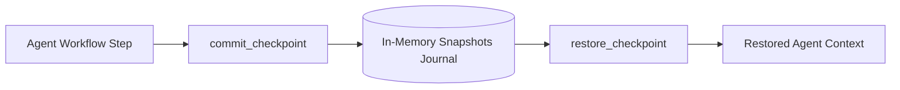

# genpark-workflow-checkpoint-state-serializer-skill

Immutable execution state journal enabling checkpoint-based rollback and deterministic agent replay.

## Architecture

## Features
- **Deep Serialization**: Prevents mutation of previous snapshots.
- **Replayability**: Enables time-travel debugging across agent steps.
